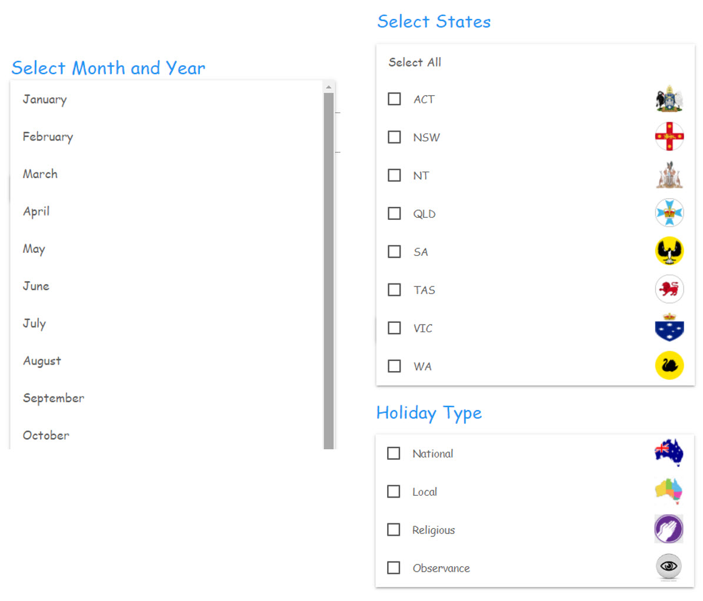
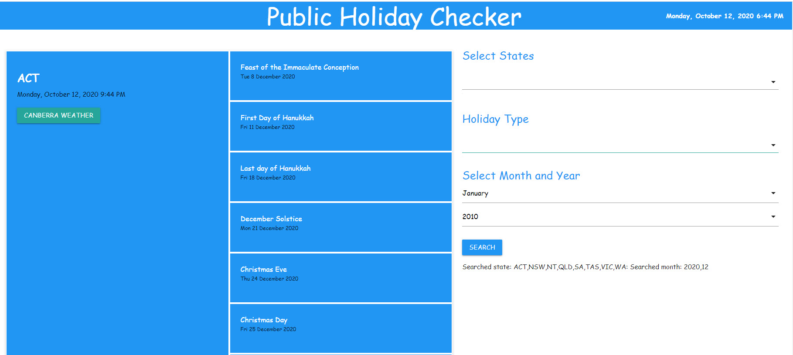
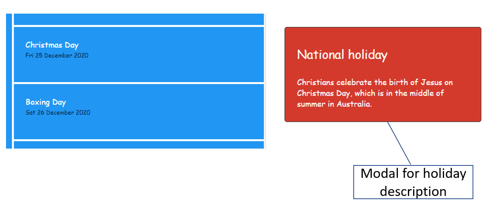
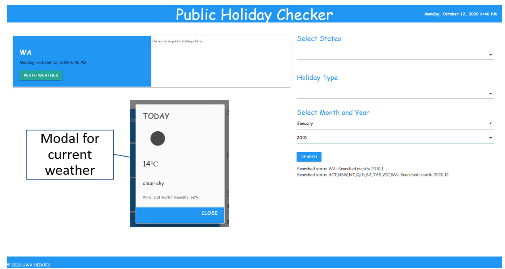

# Public Holiday Checker

#### Access App Here: https://grandbearsleepy.github.io/Public-Holiday-Checker/

## User Stories
```
AS A busy professional who works across multiple states in Australia
I WANT to see at a glance when holidays are being observed
SO THAT I can schedule events and meetings that won't conflict with non working days
```
```
AS An traveller in Australia
I WANT to know my destintationstates coming holidays and weather
SO THAT I can plan my journey
```
```
AS An interstate traveller
I WANT to know the upcoming events and holidays in the different 
states I plan to visit, as well as context behind them
SO THAT I am culturally informed
```
## Technologies Used
This was an interesting project to execute as it required the merging of multiple 
concepts that we've learned to date.  We had to use client-side storage to persist
data, the UI had to be polished & mobile responsive and we could not use alerts,
confirms or prompts, instead we used modal.

The 2 API's we used were:
 * https://calendarific.com/
 * https://openweathermap.org/
 
The CSS framework we used was:
 * https://materializecss.com/

## Team Members & Task Breakdown
Team members & their allocated tasks for this project were as follows:
 * Leon Li: 	    Modal & Local Storage
 * Mark Pilmer: 	Styling & Responsiveness
 * Rob Sonter: 	  HTML and coding
 * Yvonne Mulligan:  API responses & Github	Project Management
 
 ## App Screen Shots
 #### App - Home Screen


 #### App - Search Criteria


 #### App - Search Results


 #### App - Modal - Holiday Description


 #### App - Current Weather

